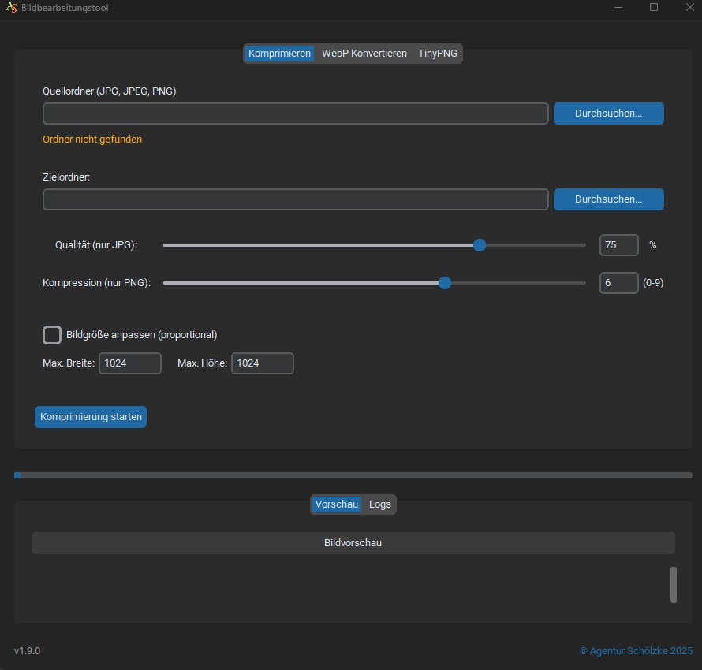

<div align="center">

# 🖼️ Bildbearbeitung & Image Optimizer Pro

**Modernes, performantes Desktop-Tool zur Stapelkomprimierung, WebP-Konvertierung und Cloud-Optimierung.**

[](https://www.python.org/)
[](LICENSE)
[](https://github.com/TomSchimansky/CustomTkinter)
[](https://github.com/mobifu/ecommerce-image-optimizer/actions)
[](https://github.com/astral-sh/ruff)
[](https://github.com/PyCQA/bandit)

<br/>



</div>

---

## 🌟 Highlights

- ⚡ **Verlustarme Stapelverarbeitung:** Verarbeiten Sie hunderte von Bildern vollautomatisch im Hintergrund ohne Einfrieren der Benutzeroberfläche.
- 🎨 **Moderne Dark/Light UI:** Intuitive Oberfläche mit CustomTkinter, Live-Fortschrittsanzeige und integriertem Log-Terminal.
- 🔄 **Next-Gen WebP Konvertierung:** Wandelt PNG- und JPEG-Dateien in moderne WebP-Grafiken für maximale Web-Performance um.
- 📐 **Smarte Skalierung:** Proportionale Größenanpassung mit automatischer EXIF-Ausrichtungskorrektur.
- ☁️ **TinyPNG Integration:** Nahtlose Cloud-Komprimierung für maximale Dateigrößen-Reduktion.
- 🛡️ **Enterprise Security:** Absicherung gegen Decompression-Bombs, Path-Traversal und Leaks von sensiblen API-Keys.

---

## 🎛️ Funktionsübersicht

| Modul | Unterstützte Formate | Funktion |
| :--- | :--- | :--- |
| **Lokale Komprimierung** | `.jpg`, `.jpeg`, `.png` | Anpassbare JPEG-Qualität (0–100 %) & PNG-Kompressionsstufen (0–9) |
| **WebP Konvertierung** | `.png`, `.jpg`, `.jpeg` | Konvertierung mit Qualitätsregler und optionaler Maximalauflösung |
| **TinyPNG Cloud** | `.png`, `.jpg`, `.jpeg` | Cloud-Kompression über offizielle TinyPNG-API mit automatischer Validierung |

---

## 🚀 Schnelleinstieg

### 1. Repository klonen & Virtual Environment anlegen

```bash
git clone https://github.com/<username>/<repository>.git
cd "Bild Berabeitung"

# Virtuelle Umgebung erstellen und aktivieren (Windows)
python -m venv venv
venv\Scripts\activate
```

### 2. Abhängigkeiten installieren

```bash
pip install -r requirements.txt
```

### 3. Anwendung starten

```bash
python main.py
```

---

## ⚙️ Konfiguration

Standardordner und der TinyPNG API-Key können entweder direkt in der GUI oder über Umgebungsvariablen hinterlegt werden:

```bash
# Beispiel-Umgebungsdatei kopieren
copy .env.example .env
```

Beispiel für `.env`:
```env
TINYPNG_API_KEY=ihr_tinypng_api_key
COMP_SOURCE_DIR=Bilder_original
COMP_DEST_DIR=Bilder_komprimiert
```

> **Hinweis zur Sicherheit:** Lokale Einstellungen (`settings.json`) und Umgebungsvariablen (`.env`) werden durch `.gitignore` automatisch vor der Versionskontrolle geschützt.

---

## 📦 Standalone Executable erstellen (.exe)

Das Repository enthält ein optimiertes Build-Skript zur Erstellung einer eigenständigen Windows-Executable mittels PyInstaller:

```bash
# Build ausführen:
python build.py

# Schneller Build ohne Cython:
python build.py --no-cython
```

Das fertige Paket wird im Ordner `dist_<timestamp>/` erstellt.

---

## 🧪 Tests & Qualitätssicherung

```bash
# Automatisierte Tests ausführen
pytest

# Testabdeckung analysieren
pytest --cov=. --cov-report=term-missing

# Sicherheitsprüfung (AppSec)
bandit -r . -x ./sichern.py,./venv

# Code-Style & Linter
ruff check .
```

---

## 🔒 Sicherheitsmerkmale

- **Zero Secret Leaks:** Keine hardcodierten Zugangsdaten; strikte Isolation lokaler Einstellungen via `.gitignore`.
- **DoS- & Decompression-Schutz:** Konfigurierte Obergrenzen für Pixeldimensionen (`Image.MAX_IMAGE_PIXELS = 120_000_000`).
- **Pfadsicherheit:** Verwendung von `pathlib.Path.resolve()` zur Verhinderung von Path-Traversal-Angriffen.

---

## 📄 Lizenz & Urheberrecht

Dieses Projekt ist unter der **GNU General Public License v3.0 (GPLv3)** lizenziert. Details finden Sie in der Datei [LICENSE](LICENSE).

© [Agentur Schölzke](https://www.agentur-schoelzke.de)
